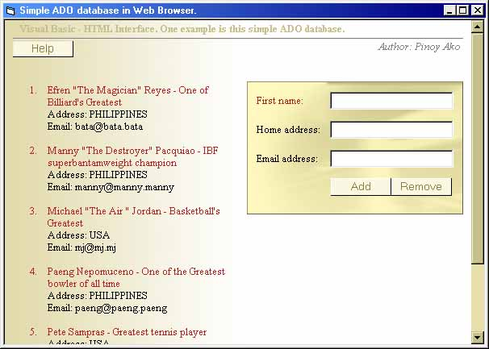



## Visual Basic \- HTML Interface \(ADO Database\)  \- no VB text box, no VB command button\.

### Description

This is a demonstartion of how to use Visual basic and HTML to create a cool application. One example is this Simple ADO database. As yuo can see in the screenshot there are text box and command button. But in fact those are HTML tags.

Requirements: Internet explorer 4 and above.
 
### More Info
 

             |
---                |---
**Submitted On**   |2003-09-29 01:41:04
**By**             |[Marshall Greg R\. Poyaoan a\.k\.a "Pinoy Ako\!"](https://github.com/Planet-Source-Code/PSCIndex/blob/master/ByAuthor/marshall-greg-r-poyaoan-a-k-a-pinoy-ako.md)
**Level**          |Intermediate
**User Rating**    |4.9 (68 globes from 14 users)
**Compatibility**  |VB 6\.0
**Category**       |[Internet/ HTML](https://github.com/Planet-Source-Code/PSCIndex/blob/master/ByCategory/internet-html__1-34.md)
**World**          |[Visual Basic](https://github.com/Planet-Source-Code/PSCIndex/blob/master/ByWorld/visual-basic.md)
**Archive File**   |[Visual\_Bas1652911022003\.zip](https://github.com/Planet-Source-Code/marshall-greg-r-poyaoan-a-k-a-pinoy-ako-visual-basic-html-interface-ado-database-no-vb-tex__1-48950/archive/master.zip)

